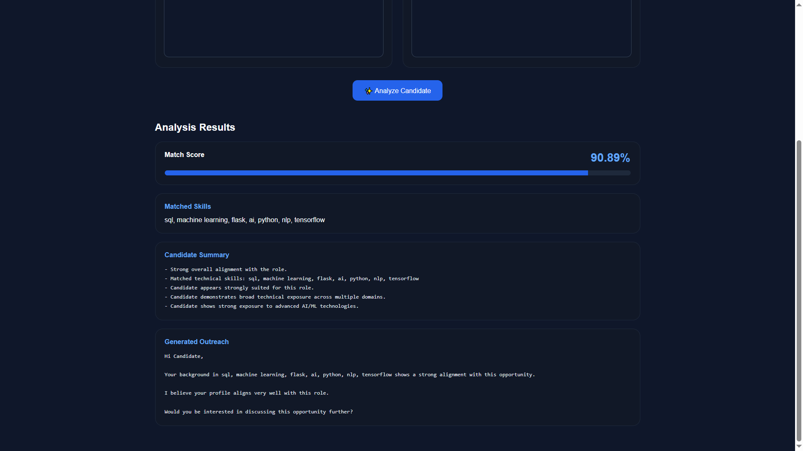
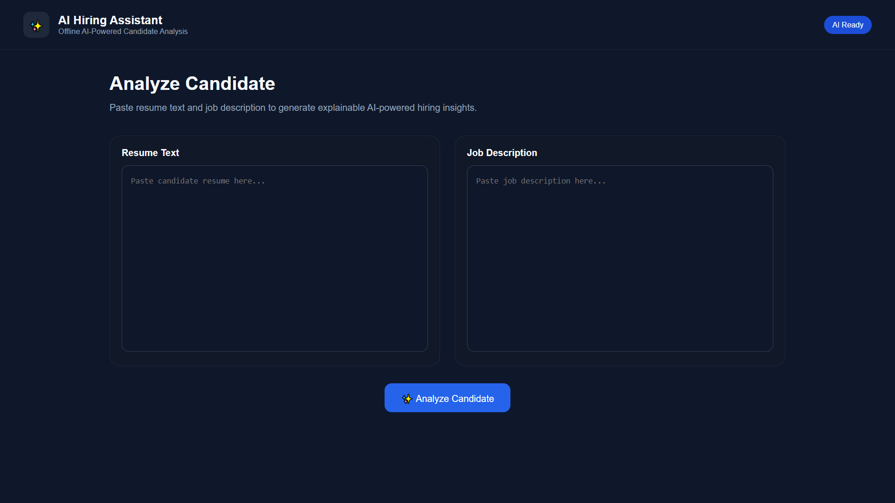
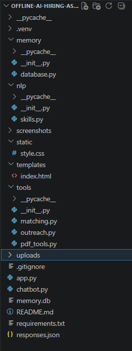

# 🚀 Offline AI Hiring Assistant

An offline AI chatbot designed for environments where **API access is limited, costly, or privacy-sensitive**.

---

## 🚀 Overview

A privacy-first offline AI hiring assistant designed to evaluate candidate-job alignment without relying on cloud APIs or external LLM services.

The system performs:

- Resume-job matching
- Skill extraction
- Explainable candidate evaluation
- Outreach generation
- PDF-based local document processing
- Persistent memory storage

All processing runs locally using lightweight NLP techniques and modular AI workflow architecture.

---

## 🧠 Key AI Features

## 🧠 Key AI Features

This project combines lightweight NLP techniques,
heuristic reasoning, and modular workflow architecture
to simulate practical AI-assisted hiring analysis
without relying on external LLM APIs.

### Explainable Matching
The system explains:
- **matched skills**
- **missing skills**
- **candidate strengths**
- **capability reasoning**

instead of returning only a raw score.

### Capability Inference
The system performs lightweight heuristic reasoning to infer:
- **broad technical exposure**
- **advanced AI/ML specialization**
- **overqualification detection**

### Privacy-First Design
All processing runs locally without:
- **OpenAI APIs**
- **external LLM services**
- **cloud inference**

---

## 💡 Why This Project Matters

Most modern AI hiring systems depend heavily on cloud APIs and external AI services, creating concerns around:

- privacy
- API costs
- latency
- internet dependency
- lack of explainability

This project demonstrates how practical AI workflows can be built locally using:

- deterministic NLP
- fuzzy matching
- explainable scoring
- modular architecture
- offline processing

---

## ⚙️ Features

- Offline AI-powered candidate-job matching
- Fuzzy NLP-based skill extraction
- Alias-aware skill normalization
- Explainable candidate evaluation summaries
- Adaptive outreach message generation
- Persistent SQLite memory system
- PDF document text extraction
- Flask-based web interface
- Hybrid scoring using:
  - TF-IDF similarity
  - skill overlap analysis
  - heuristic reasoning
- Modular backend architecture
- Zero API cost

---

## 🛠 Tech Stack

- Python
- Flask
- SQLite
- scikit-learn
- fuzzywuzzy
- pypdf

### NLP Techniques
- Fuzzy matching
- TF-IDF vectorization
- Cosine similarity
- Skill normalization
- Heuristic reasoning

---

## 📂 Project Structure

```text
offline-ai-hiring-assistant/
│
├── app.py
├── chatbot.py
├── responses.json
├── requirements.txt
│
├── nlp/
│   ├── __init__.py
│   └── skills.py
│
├── tools/
│   ├── __init__.py
│   ├── matching.py
│   ├── outreach.py
│   └── pdf_tools.py
│
├── memory/
│   ├── __init__.py
│   └── database.py
│
├── templates/
│   └── index.html
│
├── static/
│
├── uploads/
│
└── screenshots/
```

---

## 📸 Screenshots

### Dashboard Interface



### Analysis Results



### Project Structure



## ▶️ How To Run

### 1. Clone Repository

```bash
git clone <your-repo-link>
cd offline-ai-hiring-assistant
```

### 2. Create Virtual Environment

```bash
python -m venv .venv
```

### 3. Activate Virtual Environment

#### Windows PowerShell

```bash
.venv\Scripts\activate
```

### 4. Install Dependencies

```bash
pip install -r requirements.txt
```

### 5. Run Flask App

```bash
python app.py
```

---

## 🚀 Future Improvements

Planned upgrades include:

- Resume PDF upload support
- Multi-candidate ranking system
- Improved frontend styling
- Semantic memory retrieval
- Advanced role categorization
- Lightweight local embedding support
- Recruiter dashboard workflow

---

## 👨‍💻 Author

Vivek Devda  
B.Tech Artificial Intelligence & Machine Learning Student

Focused on:
- offline AI systems
- NLP workflows
- modular AI architecture
- privacy-first AI applications

---
