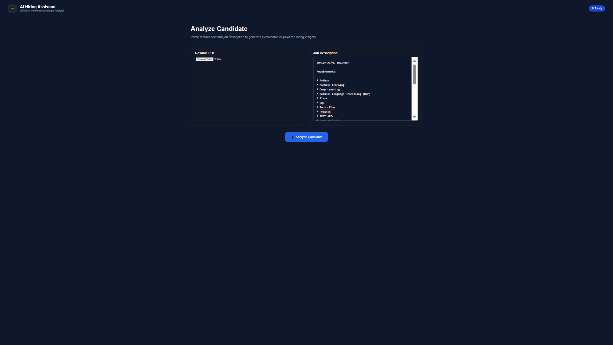
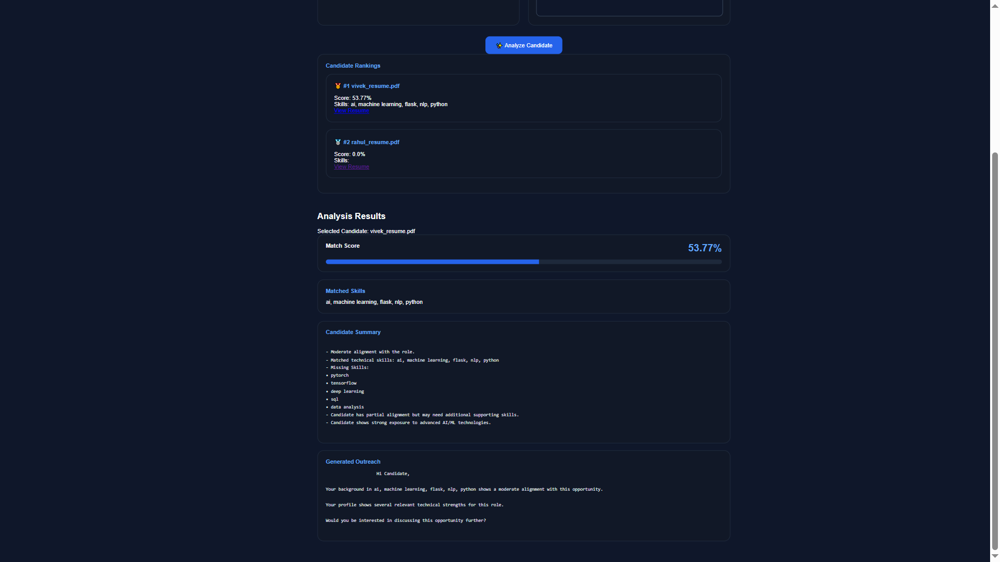
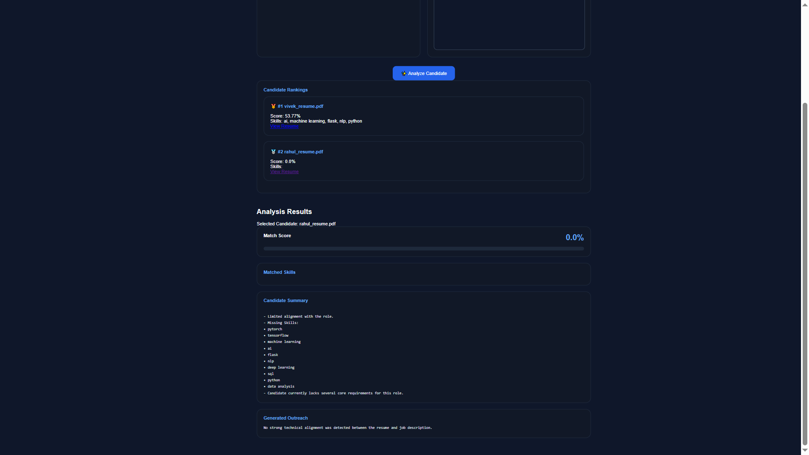
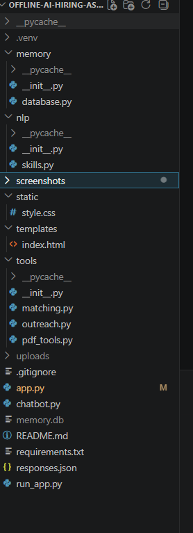

# 🚀 Offline AI Hiring Assistant

A privacy-first hiring assistant built using Python, Flask, SQLite, and lightweight NLP techniques.

This project evaluates candidate-job alignment, generates recruiter-style outreach messages, performs explainable skill matching, and stores conversation history locally without relying on external AI APIs or cloud services.

---
## Live Demo

https://offline-ai-hiring-assistant.onrender.com/

# 📌 Overview

The Offline AI Hiring Assistant is designed to demonstrate how practical hiring workflows can be built using deterministic NLP, fuzzy matching, and explainable scoring techniques.

All processing runs locally on the user's machine.

The system currently supports:

* Resume and job description matching
* Skill extraction and normalization
* Candidate-job fit scoring
* Candidate evaluation summaries
* Recruiter outreach message generation
* Local PDF document processing
* Persistent memory storage using SQLite
* Web-based interface using Flask
* Command-line chatbot interface

---

# 📸 Screenshots

## Candidate Ranking Dashboard



## Analysis Results



## Resume Viewer



## Project Structure



---


# 🧠 Features

## Resume-Job Matching

The system compares resume content against job descriptions and generates a match score based on:

* Skill overlap analysis
* TF-IDF vectorization
* Cosine similarity scoring

Outputs include:

* Match score
* Matched skills
* Candidate evaluation summary

---

## Skill Extraction Engine

The NLP pipeline extracts technical skills from text using:

* Rule-based skill recognition
* Alias normalization
* Fuzzy matching for typo handling

Examples:

* Python ↔ Py
* Machine Learning ↔ ML
* JavaScript ↔ JS
* Artificial Intelligence ↔ AI

---

## Explainable Candidate Evaluation

Instead of returning only a score, the assistant generates human-readable analysis including:

* Alignment level
* Matched skills
* Missing skills
* Candidate strengths
* Capability observations

Example insights:

* Strong overall alignment with the role
* Candidate may need improvement in specific skills
* Candidate demonstrates broad technical exposure
* Candidate shows strong AI/ML exposure

---

## Recruiter Outreach Generation

Automatically generates recruiter-style outreach messages based on:

* Match score
* Skill alignment
* Candidate suitability

This helps simulate a basic recruiting workflow.

---

## Persistent Memory System

The chatbot stores previous interactions using SQLite.

Capabilities:

* Save user interactions
* Retrieve recent conversations
* Support memory recall queries

Examples:

* What did I ask?
* What did I say earlier?
* Previous question

---

## PDF Document Processing

The system can extract text from local PDF documents for basic document search workflows.

Supported functionality:

* PDF text extraction
* Keyword-based document lookup

---

## Intent Detection

The chatbot uses fuzzy matching to identify user intent.

Current supported intents include:

* Greetings
* Help requests
* Document search
* PDF search
* Job matching

---

## Decision Routing

A lightweight decision engine routes requests into different workflows:

* Normal response
* Clarification request
* PDF search
* Resume-job matching

---

## Web Interface

A Flask web application provides a browser-based interface.

Users can:

1. Paste resume text
2. Paste job description
3. Run analysis
4. View results

Displayed outputs:

* Match Score
* Matched Skills
* Candidate Summary
* Outreach Message

---

## Command-Line Chatbot

A terminal-based chatbot interface is also available.

The chatbot supports:

* Intent detection
* Memory recall
* PDF search
* Resume-job matching workflows

---

# 🛠 Tech Stack

## Backend

* Python
* Flask
* SQLite

## NLP & Data Processing

* scikit-learn
* fuzzywuzzy
* python-Levenshtein
* pypdf

## Techniques Used

* TF-IDF Vectorization
* Cosine Similarity
* Fuzzy Matching
* Skill Normalization
* Rule-Based Intent Detection
* Heuristic Candidate Evaluation

---

# 📂 Project Structure

```text
offline-ai-hiring-assistant/
│
├── app.py
├── chatbot.py
├── responses.json
├── requirements.txt
│
├── nlp/
│   └── skills.py
│
├── tools/
│   ├── matching.py
│   ├── outreach.py
│   └── pdf_tools.py
│
├── memory/
│   └── database.py
│
├── templates/
│   └── index.html
│
└── memory.db
```

## Clone Repository

```bash
git clone <repository-url>
cd offline-ai-hiring-assistant
```

## Create Virtual Environment

```bash
python -m venv .venv
```

## Activate Environment

### Windows

```bash
.venv\Scripts\activate
```

### Linux / macOS

```bash
source .venv/bin/activate
```

## Install Dependencies

```bash
pip install -r requirements.txt
```

---

# ▶️ Run Web Application

```bash
python app.py
```

Open:

```text
http://127.0.0.1:5000
```

---

# ▶️ Run Chatbot

```bash
python chatbot.py
```

---

# 🚧 Planned Improvements

The current version does not yet include:

* Resume PDF upload through the web interface
* Multi-candidate ranking
* Vector databases
* Embeddings-based retrieval
* Recruiter dashboard
* Job recommendation engine

---

# 👨‍💻 Author

**Vivek Devda**

B.Tech Artificial Intelligence & Machine Learning Student

Interested in:

* AI Systems
* NLP Applications
* Workflow Automation
* Backend Development
* Privacy-First AI Solutions
